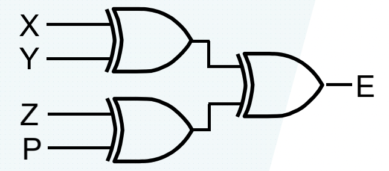
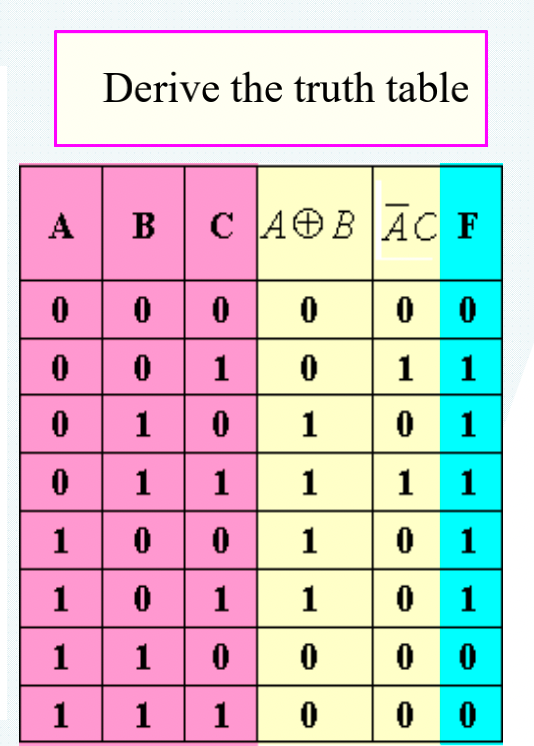
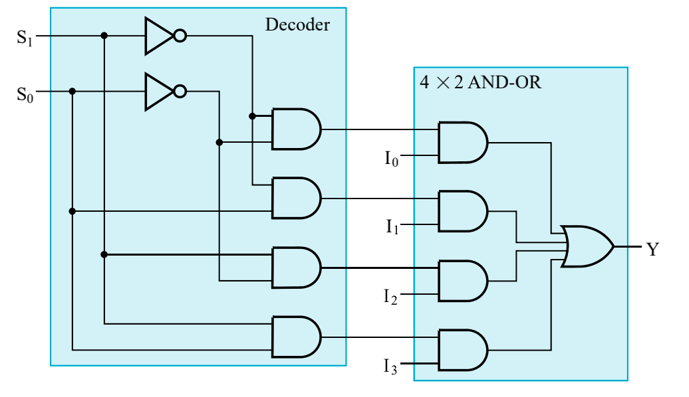
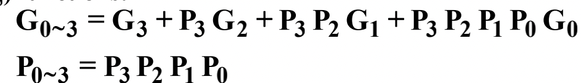
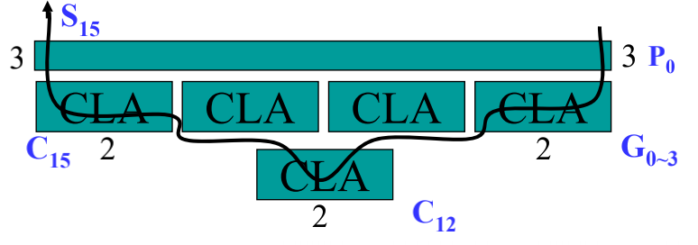

# 快乐复习orz

> 补的是天, 流的是泪
>
> ——2021.12.20 于西教
>
> 我有一个猜想, 不一定对, 就是数逻这门课的内容确实可以在一周之内从无到有学完.
>
> ——2021.12.31于西教

# Chapter 1

> Topic: Digital Computers and Information

## 信号

信号是用物理量表示的信息变量, 在数字系统中, 用离散的值表示.

二进制是数字系统中最常用的表达方法. 0/1 对应真值的True/False, 电平的Low/High(或相反, 负逻辑), 开关的关/开.

模拟信号是随着时间, 信息连续的:

数字信号是离散的, 即一定范围内的模拟信号被认为是1, 一部分被认为是0:

上图是异步情形; 如果是同步情形, 那么值和时间的取值都是离散的.

一般用**电压/电流**来划分信息的0/1, 比如:

用一定的阈值来划分. 不能用十进制来表示是因为这样会使每一个数值的范围缩小, 不容易容纳噪声的存在.

## 数字系统

数字系统的结构是: 有离散的输出, 在经过离散信息处理系统之后(有可能有系统状态的改变)后输出离散的值.

* 组合电路

  没有状态, Output = F(Input)

* 时序电路

  有状态(现态, 次态)

  * 状态在离散的时间处更新

    同步时序系统

  * 状态随时更新

    异步时序系统

  * State = F(State, Input)

  * Output = F(State, Input) Mealy型或F(State) Moore型

## 算术运算

乘法

## 进制间转换

以二进制于十进制为例.

整数部分除二得余数, 最终将结果倒过来.

小数部分乘二得整数部分, 顺序不变.

## 编码方式

### BCD码

> Binary Coded Decimal

使用四位二进制表示一位十进制

#### Weighted Code

> 8421 code

举例: $0111=0\times 8+1\times 4+1\times 2+1\times 1=7$.

注意: 如果两个8421code之和大于等于`1011`, 那么应该加6(0110)以得到正确结果:

> 5421 code

最高位在表示5~9时为1, 0~4时为0.

> 2421 code

低三位表示0~7, 1110表示8, 1111表示9.

#### Nonweighted code

> 余三码(Excess 3 Code)

将8421BCD码加3得到, 对于余三码的加法, 如果结果小于等于10进制的10, 那么要减3, 否则要加3.

#### Gray Code

格雷码.

相邻每一位十进制数的二进制表示都有且仅有一位不同.

上述总结来看:

#### 奇偶校验码

Parity Code

用来检验数据每一位数共有奇数个1还是偶数个1.

> 奇校验
>
> 1000001 --> 11000001
>
> 1010100 --> 01010100

永远使结果一共有奇数个1.

> 偶校验
>
> 1000001 --> 01000001
>
> 1010100 --> 11010100

永远使结果一共有偶数个1.

# Chapter 2

## 门电路和布尔方程

### 二值逻辑和门

二值逻辑用1 0代表真假, 有与, 或, 非等逻辑操作

注意正负逻辑.

#### CMOS

抗噪声性质好, 低静态能耗, 生产过程复杂.

组成:

特点: gs间电压高于阈值时闭合, 低于时打开.

使用CMOS搭建逻辑门:

### 布尔代数

需要注意的是, 如果已知$X+Y=X+Z$ 或$XY=XZ$, 我们不能直接得到$Y=Z$.(不能消去)

对于每一个布尔函数, 它的真值表是唯一的, 但是给定一个真值表, 可能有多个布尔函数与之对应.(从布尔函数到真值表映射满射但不单射)

一些常用的化简:

常用的还有吸收律$A+AB=A$, $A+\overline AB=A+B$(以及$A(A+B)=A$, $A(\overline A+B)=AB$).

包含律$AB+\overline AC+BC=AB+\overline AC$.

#### 相等的布尔函数

(满足输入信号相同)iff 对于任意一组输入信号, 两个函数的输出都完全一样.

#### 反函数

$\overline F$, 是将F的真值表中0 1 对换得到的, 比如$F=\overline AB+C\overline D$, 有$\overline F=(A+\overline B)\cdot(\overline C+D)$.

**特点**: 保持优先级

不对组成部分直接取反:

#### 对偶

$F'$, 是F的对偶函数(the dual of a function F), 将式子中的与和或对换, 0 和1对换. 注意保持优先级.

F‘是F的对偶, F时F’的对偶. 如果F=G, 那么F'=G'.

#### 替代原则

对于式子中的某一个变量A, 可以用**等于**A的式子进行代替.

举例:

类似的, 我们可以得到:
$$
f(X_1,X_2,...,X_n)+\overline f(X_1,X_2,...,X_n) = 1
$$

#### 其他公式

Formula 1:

这是$X\cdot\overline X=0, X\cdot X=X$的拓展.

类似的我们可以得到“加法”形式:

举例:

 Formula 2:

对于一个同时包含某一元素和它的反的布尔函数, 我们可以利用:

进行化简. 类似的, 还有:

### 标准形式

#### 最小项

最小项是使用*与*连接不同变量得到的项, 因为每一个变量都有normal形式和complemented形式, 所以最小项一共有$2^n$种.

最小项直接表现的就是真值表中为1的部分, 对于每一个最小项的和$\sum m_i=1, i=0,1,2...,2^n-1$.

任何一个最小项不是在F中就是在$\overline F$中.

对应表:

举例:

normal形式的变量取1, complemented形式的变量取0.

#### 最大项

是由变量的“和”(OR)组成的项, 同样由$2^n$种.

对于任意两个最大项的和$M_i+M_j=1, i\neq j	$.

所有最大项的积$\prod_{i=0}^{2^n-1}M_i=0$.

每一个最大项不是在F中就是在$\overline F$中.

对照表:

与最小项相反, normal形式取0, complemented形式取1.

#### 最小项与最大项的关系

每一个最大项是与之index相同的最小项的反函数.
$$
M_i=\overline {m_i}, m_i=\overline{M_i}
$$
比如:$m_3=\overline ABC, M_3=A+\overline B+\overline C$.

我们还可以得到:
$$
F=\sum m_i=\overline{\prod M_i}, i=0,1,2,...,2^n-1
$$
如果我们得到一个真值表, 应该怎么得到$F \& \overline F$.

通过真值表, 我们很容易写出来最小项形式$F=\sum m(0, 2, 5, 7)$, 在F最小项中没有的都在$\overline F$中, $\overline F=\sum m(1, 3, 4, 6)$.

对F的SOM直接取反可以得到$\overline F$的POM, $\overline F=\prod M(0, 2, 5, 7)$.

对$\overline F$的SOM直接取反可以得到F的POM,$F=\prod M(1, 3, 4, 6)$.

#### SOP&POS

*SOP*(Sum-of-Products form), *POS*(Product-of-Sums form).

举例:

## 电路化简

需要使用的“成本”: 文字成本(Literal cost, L), 门输入成本(Gate input cost, G), 带反相器的门输入成本(Gate input cost with NOTs, GN).

#### 文字成本

在公式中一共出现的变量个数, 可重复计数.
$$
F=BD+A\overline BC+A\overline C\ \overline D
$$
的门输入成本为8.

#### 门输入成本

* 所有的文字成本
* 所有项的总数(不包括单个变量的项, 比如A), 比如ABC, $A\overline B$都算一个
* 如果计算GN: 不同种类的反相器输出的变量(不重复计数, 多个$\overline A$按照一个成本来计数).

其实门输入成本就是逻辑图中, 各种门的输入总量.

其他例子:

#### 简化表达式

通常情况下, 表达式越简单, 电路实现越简单, 成本越低.

使用之前学到的布尔函数化简的方法进行简化.

再强调一下消除律:
$$
A+\overline AB=A+B
$$

对于POS形式的化简, 可以先取对偶式得到SOP, 然后化简之后再取对偶式得到结果:
$$
(F')'=F
$$

##### 卡诺图(Karnaugh Maps)

一般用来化简含有2, 3, 4个变量的布尔函数.

卡诺图的特点: “相邻”的位置二进制表示只相差一位.

双变量:

三变量:

四变量:

五变量:

***概念***:

* 蕴含项 Implicant: map中的每一个格子, 一共$2^n$个.
* 质蕴含项 Prime Implicant: map中相邻的质蕴含项组成的长宽均为2的幂次的最大矩阵(比如1\*2, 2\*2, 1\*4).
* 质主蕴含项 Essential Prime Implicant: 包含仅包含在他之中的蕴含项的质蕴含项.(就是少了这个质蕴含项, 其他的质蕴含项全用上也少了格子).

如果要求最大项之积, 将最小项填1, 其他地方写0, 对0进行操作, 得到的就是最大项.

***Don't-Care Conditions***:

用$\times$表示不在乎的最小项位置, 他可以是0可以是1, 在化简的时候不需要考虑有没有$\times$遗漏, 但可以利用它做桥梁沟通1(求normal形式) 或沟通0(求complemented形式).

简化举例:(顺便复习一下门输入成本)

## 其他门与电路

最原始的门种类: AND OR NOT NAND NOR..

Complex gate: 需要一个以上 原始门组成的, 比如异或(Exclusive-OR)XOR, XNOR, AND-OR-INVERT(AOI).

### 其他种类的门

#### 缓冲器

> Buffer

F=X

不改变输入的值, 仅作为一个“放大器”, 将输入的信号放大后输出.

同时可以提高电路的运行速度.

#### NAND

NAND是自然搭建速度最快的门.

使用NAND可以组成任何逻辑, 即NAND为universal gate.

NOR也是universal gate.

#### 异或

$$
X\oplus Y=X\overline Y+\overline XY
$$

对于多变量的“异或”

联想之前的“奇偶校验”, 我们不难得到奇偶发生器(Parity Generators)和Chekers.

三变量偶发生器(有奇数个1则P=1, 不然为0):

输出P为检查位.

三变量偶校验:(0为正常, 1为Error)

### 高阻抗输出

> Hi-Impedance Outputs

之前的门输出不是0就是1, 我们不能将他们的输出直接连到一起, 并且仅能单向的传递信息.

Hi-Z, 指开路, 没有连接, 我们这里将Hi-Z仅有: 三态门和transmission gate. 上述两种门都有一个输入和一个控制输入.

#### 三态门

> 3-state buffer

当EN=0时, 不管输入是什么, 输出都是高阻; EN=1时, 输出和输入一致. (EN: enabled)

三态门输出相连:

当两边EN不同时, 输出为EN为1 的输出值; 当两边EN都是0时输出高阻, 当两边EN都是1时, 不被允许.

#### Transmission Gates

用来连接和断开电路中两点的门.

举例:

# Chapter 3

> Topic: Combinational Logic Design

## 设计概念和设计流程

### 设计概念

逻辑电路分为两种: 组合电路和时序电路. 其中组合电路(*Combinational Logic Circuit*)指的是输出和时间无关, 仅取决于输入的值.

输入n个布尔值, 输出m个布尔值. 需要m个布尔函数对输出进行定义.

层次设计, 9输入奇校验器: 

 

### 设计流程

* Specification
* Formulation, 真值表, 布尔函数表达式等.
* 简化, 对公式内容进行简化
* 技术映射(Technology Mapping)
* 验证

### 技术映射

#### 使用NAND的映射

* 将AND和OR用NAND与反相器替换.
* 一条路上只有至多一个反相器

使用NOR的映射同理

举例:(可用2 3 输入NAND和2输入NOR以及反相器)

(a)原始map, (b) 将AND OR替换为NAND和反相器, (c) 用2输入NOR和3输入NAND进一步简化. (d) 减少反相器

### 验证

真值表等方法   

### 逻辑电路分析

* 写下布尔函数表达式

* 得到真值表

* 功能分析
  * 定义对任一信号的作用以及整个电路的作用
  * 画时序图

* 验证

## 功能模块

### 功能和功能块

一个函数的具体实现称为功能块.

SSI MSI LSI 小中大规模集成电路

VLSI 超大规模集成电路

### 基本逻辑函数

* 固定值(0 或1): 接地或vcc
* 传输: buffer
* 反向: 反相器
* 使能
  * EN=1有效 $F=X\cdot EN$, 不使能时输出0.
  * EN=0有效 $F=X+\overline{EN}$, 不使能时输出1

#### 多位的基本功能实现

用粗线表示总线.

#### 使能

如上所述, 在不使能时输出可能Hi-Z, 0或1. 使能时输出输入值.

### 译码

译码是将n位输入转换成m位输出($n\leq m\leq 2^n$), 使得每一个输入都能对应唯一的输出.

用来译码的功能块叫做译码器, n-to-m line decoders.

在设计输入位数比较多的译码器时可以通过“递归”的思路进行设计:

> 要设计一个n输入译码器, 可以通过两个n/2输入译码器. 如果n为1, 则只需要1-to-2 line译码器, 返回.

以3-8译码器为例:

对于7-to-128 line decoder:

信号分离器(带使能信号的译码器), 只要在输出位置多m个2输出与门将输出与使能信号做与.

通过译码器和OR可以组成任何组合电路.

### 编码

译码的逆操作, m输入, n输出, 实现这一功能的电路称为编码器.

#### 优先编码器

可以对同时输入多个1进行相应, 产生一个有意义的结果的编码器. 从多个1中, 他会选择一个更加重要的输入进行解码.

一个例子:

### Selecting

有一组输入数据DBUS, 一组控制数据CBUS, 一个输出Y.

多路复用器: 执行选择操作的电路.

选择操作也可以通过三态门逻辑电路和传输门实现.

#### 多路复用器(Multiplexers)

n个selection inputs, $2^n$个information inputs, 一个输出. 也可以有m($m\leq 2^n$)个数据输入.

**2-to-1 line multiplexer**

一般来说, 一个2^n^-to-1 line multiplexer需要有n-to-2^n^  line decoder和2^n^个AND以及一个OR

**拓展多路选择器位宽**

将decoder的输出连到多组AND-OR组合的选择部分即可.

#### 其他选择器

基于三态门的:

特点就是可以直接将输出相连, 不需要最后的或门了.

更进一步将decoder也用三态门组成:

基于传输门的:

## 算术函数和电路

### 迭代组合电路

> Iterative Combinational circuit

对二进制组合进行运算, 在每一个二进制位上进行同样的操作. 我们可以先针对一个位进行设计形成一个功能块, 之后通过功能块得到函数. 

> cell 子功能块
>
> iterative array: 一组相互连接的cell

### 二进制加法器

#### 半加器

> Half-Adder

两输入, 两输出的加法器. 对两个二进制输入做和, 得到sum和进位.

通过真值表可以得到
$$
S=X\oplus Y
$$

$$
C=XY
$$

还可以有:
$$
\overline{C}=\overline X+\overline Y
$$

$$
S=(X+Y)\overline C
$$

#### 全加器

三输入两输出, 较之半加器多了一个进位输入.
$$
S=X\oplus Y\oplus Z
$$

$$
C=XY+(X+Y)Z
$$

这里可以将$X\oplus Y$重复利用:

#### 行波加法器

举例: 将A(3:0)与B(3:0)相加得到S(3:0)和一个进位C.

这样做的缺点在于传播延迟较大.

#### 超前进位加法器

对于一位加法器, 如果输入AB都为1, 那么进位肯定是1(Generate); 如果AB的S为1且上一个进位为1, 那么进位为1(Propagate).

我们有:
$$
P_i=A_i\oplus B_i, G_i=A_iB_i
$$

$$
S_i=P_i\oplus C_i, C_{i+1}=G_i+P_iC_i
$$

从C~0~开始, 我们可以得到:

从而:

实践中, 如果单纯通过这种方式直接得到超前进位加法器, 那么随着位数增多, 扇出驱动能力会不足, 因此我们可以使用多个超前进位加法器组成一个有更多位的.

规定:

可知:

每一块需要的仅是上一块的进位结果, 每一次进位结果延迟为3.

分层次进行, 对于16位加法器, 行波进位加法器最长延迟36, 超前进位加法器最长延迟12.(NOT=1, AND-OR=2, XOR=3)

### 知识补充

#### Diminished Radix Coplement of N

对于基数r, 称为(r-1)‘s complement. 对于二进制就是1’s complement(反码).

得到结果是: (r^n^-1)-N.

二进制反码就是对每一个位分别取反.

#### Radix Complement

对于基数r, 为r‘s complement. 对于二进制是2’s complement(补码).

得到结果是r^n^-N.

二进制补码: 对于正数就是它本身, 对于负数就是反码加1, 也就是先取反再加一.

#### 有符号数

Signed-Magnitude形, 较为简单, 但是会出现有两种0的情况.

Signed-Complement, 常用情形. 正数符号位0, 负数符号位1, 后边按照无符号数取补码.

### 二进制加减法器

二进制减法(有符号数): 先对减数取补码, 再与被减数相加得到结果.

可以得到二进制加减法器:

S=1时为减法器, S=0时为加法器. 此时C0也符合要求(加法时无进位, 减法时需要加1得到补码).

### Overflow

什么是溢出? 需要用n+1位表示n位加减法结果的情况就是溢出.

#### 无符号数溢出

只需要看进位, 如果加法进位1, 那么就发生了溢出.

#### 符号数溢出

对两个符号位相同的数做加法或者两个符号位不同的数做减法

如果是使用补码得到的负数: 可以通过$V=C_n\oplus C_{n-1}$来判断是否发生了溢出(1为溢出).

#### 常数除法/乘法

对于2的幂次可以通过移位得到结果, 非2的幂次, 可以常数加法和2的幂次的乘除相结合得到结果.

# Chapter 4

> Topic: Sequential Circuit

## 存储元件与分析

### 时序电路介绍

基本的存储元件有: 锁存器(Latch)和触发器(Flip-Flop)

与组合电路相比, 时序电路多了现态, 次态

Moore型和Mealy型: Moore(Output = h(Present State)), Mealy(Output = g(Inputs, Present State)).

### 时序电路分类

根据**存储元件什么时候观测输入**和**存储元件什么时候改变状态**分为*同步*和*异步*.

**同步**: Synchronous

* 在某几个时间检测
* 什么时候观测输入和改变状态仅与时间信号有关

**异步**: Asychronous

* 在任何时间都可以改变, 观测输入与改变状态.

(如果把时钟信号也当作一种input, 那么所有电路都是异步的)

#### 离散事件模拟

* 门用理想化的公式处理输入, 并且有一个固定的延时
* 每当有输入的改变都作出对应输出
* output的结果会与input之间有一个固定的延时
* output改变的一瞬间, output驱动的所有输入都改变(忽略传输时间)

一般将delay的时间写在对应的门模型上, 比如

注意反相器的延时可能会导致output有一小段相反的值, 比如

### 存储元件

#### 锁存器

##### $\overline S-\overline R$ Latch

利用NAND组成的锁存器.

低电平有效, 比如S=0时set, R=0时RESET, 保持状态为全都是1, 如果同时为0会产生错误.

##### S-R Latch

对应的, 用NOR组成的锁存器.

高电平有效, S=1时set, R=1时reset, 保持状态为均0, 如果同时为1会产生错误.

**小总结**: 对于上边两种锁存器, 重点在于什么是有效的电平, 在有效电平时产生对应动作, 如果两者都处在有效电平, 那么会导致后续保持时产生错误(震荡或不可控制).

##### 带时钟信号的S-R锁存器

注意: 一带时钟信号, 由于第一层电路有一个反向(NAND), 此时利用NAND构成的是**高电平有效**.

只有在C处于高电平的时候, S R的改变才会对后边的存储部分(以及输出)产生影响.

为了解决S R同时到有效电平导致错乱, 在原本S R的地方用一个反相器加一区分, 即D锁存器.

##### D锁存器

同样的, C为高电平的时候才会对输出有影响.

D为1时set, 为0时reset, 即输入什么D在这一个周期中输出就是什么.

利用传输门的D锁存器:

**传输门**: 既可以传送数字信号又可以传输模拟信号的可控开关电路.

这玩意用掌握吗? 反正我是没看懂.

##### 锁存器的时序问题

在一个时钟周期内, 我们希望存储的值仅可能改变一次, 但是如果我们在C=1时多次改变输入, 那么对应输出也会发生改变, 即“空翻”

为了解决空翻现象, 我们设计了触发器. 主要的思路是打破锁存器输出和下一步输入**(利用组合电路)直接相连**的情况.

#### 触发器

触发器主要有主从触发器和边沿触发器.

##### S-R主从触发器

左侧为主(Master)右侧为从(Slave).

什么时候观测输入? C=1时

什么时候改变输出? C=0时

(这时, 通路被不同的时钟信号(本身和取反)截断了.) 在C=1处即使有多次的数据改变, Slave也不会对这些数据进行输出(因为对他来说, 现在$\overline C$=0)

##### 主从触发器的时序问题

尽管解决了空翻的问题, 但是S-R著丛触发器仍然具有一定的问题.

(非时序) 使得电路的速度被时钟信号脉冲限制, 整体变慢了.

(时序) **一次性采样问题**(1s catching): 在C=1的时候, master仍然会接受S R的信息, 那么当本身Q=0, R=0, S因为数据的抖动从0变1又变0, 这个时候master的输出会先变成1然后**保持**, 之后C=0, Slave收到了这个信号变1; Q=0, S=0时R抖动同理, 只不过将输出最终变为0. 由于这是数据抖动的结果, 并不是我们希望的. 

针对这个问题, 设计了边沿触发器.

##### 边沿触发器

在脉冲稳定时保持不变, 仅在时钟脉冲改变的边沿处检测输入.

我们将master换为D Latch.

在C=1时有再多的波动, 只要在时钟边沿前一段时间没有问题, 都不会发生错误, 解决了一次性采样问题. 这是一个**负边沿触发器**.

在CLK上加一个反相器我们就得到了一个正边沿触发器.

$$
Q(t+1)=D(t)
$$
带异步控制的正边沿触发器

这里$\overline S$和$\overline R$指的是低电平有效.

怎么画触发器?

##### 为什么D触发器解决了一次性采样问题

从一次性采样的产生原因来看, 是SR同时为0时是保持的状态, 因此如果S或R其中之一信号在C=1时有波动, 那么master会在信号波动恢复后保持下来这个波动的结果(Set 或Reset).

而D触发器将master从SR latch换为D, 不存在“保持”这种情况, 因此可以更好的容纳时钟脉冲中间的信号波动, 只需要在边沿处保持信号.

##### 触发器时间参数

主要有(**以下以正边沿举例, 负边沿只要对应倒过来**:

* Set up time: 在正边沿之前要维持一段时间信号保持不变.
* Hold time: 在正边沿之后要维持信号的时间.
* clock pulse width: 脉冲宽度(一个脉冲时间), 一般是时间周期的一半(正负脉冲时间相同).
* propagation delay: 传播延迟
  * t~PHL~: 从高电平到低电平
  * t~PLH~: 从低电平到高电平
  * t~pd~: 一般取上面两个的最大值.

但是对于主从触发器(C高电平有效):

* Setup time 整个C=1时
* hold time C=1转到C=0的一段

对于边沿触发器
$$
t_s \leq t_w
$$
对于主从触发器
$$
t_s = t_w
$$
t~h~通常是0

t~pd~从触发变化的时钟边沿(正边沿触发器就是clk的正边沿)开始到output改变的时间.

#### 其它类型的触发器

##### J-K触发器

用J K分别替换S-R触发器的S R, 但是JK同时为1时表示状态反转;

同样具有一次性采样问题.

为了避免一次性采样, 可以用正边沿触发器作为核心.

##### T触发器

输入T, T=0时状态不变, T=1时, 状态反转.

与J=K=T的J-K触发器相同.

需要用异步控制来初始化.

### 时序电路分析

整体来说, 模型就是:

* 现态: 存储在一系列触发器中
* 次态: 是现态和输入的一个布尔函数
* 输出: 是现态(有时与输入相关)的一个布尔函数

#### 状态表(State Table)

现态, 输入, 次态, 输出

比如

#### 状态图(State Diagram)

圈里写状态名, 箭头从现态指向次态, 箭头上写输入, 在圈中(Moore)**或**箭头线(Mealy)上写输出.

时序电路分析步骤

* 写出output方程, 次态方程
* 写出真值表(input&现态, output&次态)
* 画状态图

### 电路和系统级时间参数

t~p~: clock period, 一个时钟周期的时间

t~pd,COMB~: 组合电路的传播延迟从master的output到slave的input.

t~slack~: 松弛时间, 在所有路径中一定要大于等于0.

用上述公式进行计算时t~pd~有时要换成t~PHL~或t~PLH~, 这要考虑到所经过的门和对应的输入输出是那种情况.

## 时序电路设计

* 状态图或状态表
* State Assignment: 赋予状态名以二进制
* 确定方程
* 化简
* 工艺

跟着例子走一遍就可以

> 设计识别“1101”的时序电路

### 等效状态

对于任何相同的输入, 两个状态S~1~, S~2~的输出都相同, 则称(S~1~, S~2~).(并查集啊喂)

等效状态有三种情况(**首先必须满足对于同一组输入, 输出完全相同**)

#### 次态相同(或次态等效)

#### 互为次态

例子给的是一种输入次态相同, 一种输入互为次态.

#### 隐含表

利用隐含表将不可能等效的内容一一排除, 让互相决定能否等效的内容等效

举例

输出不完全相同的打叉, 输出和次态完全一样的打勾, 能等效需要依赖的写到方格中.

### 状态分配的基本规则

* 有相同次态和输出的的状态分配相邻的binary code
* 是同一现态在相邻输入下的次态分配相邻的binary code
* 有相同输出的状态分配相邻的binary code
* 初态或者最常用到的状态分配0

自上而下考虑.

# Chapter 5

> Topic: Digital Hardware Implementation

### 传播延迟

什么是t~PHL~, t~PLH~, 这里high-to-low看的是output而不是input, 一个例子

传播延迟(Propagation Delay)

* 传输延迟(Transport Delay): 从input改变到output改变的时间
* 惯性延迟(Inertial delay): 与传输延迟类似, 如果能够改变输出的input在短时间内翻转两次, 并且间隔时间小于一个*拒绝时间*, 那么第一个input的转变导致的output变化将不会出现.

### 扇出(Fan-out)

可以用标准荷载来衡量, 是某一个门的输出可以驱动的标准荷载数量. 

对于一个4输入NAND门:

### Cost

门成本主要是占据的芯片面积, 面积又大致和晶体管的数量和尺寸以及连线数量决定. 如果忽略连接线数量, 那么可由门输入数量来估计成本.

### 正负逻辑

正逻辑的AND和负逻辑的OR, 需要的门电路是一样的.

正负逻辑区别在于高电平表示1还是0.

### 可编程逻辑

现场可编程(field-programmable), 可以在制造环境外编程.

大多数可编程逻辑设备都是可以擦除和重新编程的.

#### 编程技术

* 在硬件上操作
  * Musk Programming(没查到什么玩意)
  * Fuse 熔丝, 让原先短接的点断开
  * Antifuse 反熔丝, 让原先断开的点短接
  * Single-bit storage element

* 建立查找表
  * 存储设备
* 控制晶体管开关
  * 在浮动晶体管栅极上的存储电荷(看不懂啥意思)
    * 可擦除的
    * 可电擦除的
    * Flash

永久性的(不可以重新改变的): Mask programming, Fuse, Antifuse

可以重复编程的: 挥发性(不给芯片供电, 程序就消失)的: single-bit storage element; 不挥发性的: Erasable, Electrically erasable, Flash

### 可编程装置

ROM: Read Only Memory, 由固定的AND阵列和可编程的OR阵列构成

PAL: Programmable Array Logic, 可编程的AND阵列和固定的OR阵列

PLA: Programmable Logic Array, 可编程的AND阵列和可编程的OR阵列

CPLD&FPGA: Complex Programmable Logic Device & Fileld-Programmable Gate Array.

#### ROM

* N inputs
* M outputs
* 2^N^ decoded minterms

AND固定, OR可编程

#### PAL

PAL与ROM相反, AND可编程, OR固定

#### PLA

懒得写了

总之就是AND 和 OR阵列都可编程.

# Chapter 6

> Topic: Registers & Register Transfers

## 寄存器

一组二进制存储器. 主要有**存储**, **移动**和简单的**运算**.

举例: 2-bit 寄存器的状态表

### 寄存器设计模型

如何设计一个寄存器?

* 向寄存器中加入已有的组合电路
* 先利用状态图/表设计小的结构, 再组合成为一个寄存器

### 寄存器的储存

主要涉及: **保存**和**Load**(实在不知道什么翻译更好了)

Load信号主要目的: 控制寄存器是保存现有的值还是从input获取而改变; Load=1时根据input作出改变, Load=0时保持不变.

### 带时钟门控的寄存器

(Registers with Clock Gating)

对正边沿触发器和负脉冲主从触发器而言:
$$
Gated\ Clock = Clock+\overline{Load}
$$
存在的问题: 门控时钟和真正的时钟之间有一个位移(因为组合电路的延迟)

### 带负载控制反馈的寄存器

Registers with Load-Controlled Feedback

这样可以实现持续的时钟信号, 在Load=0时选择寄存器现有的值(即save), load=1时选择输入的值.

这样电路比之前的复杂但是解决了刚才的时序问题.

## 寄存器传输操作

>  Register Transfer Operations

包括数据的移动和处理.

涉及到: 寄存器集, 操作, 控制操作的指令.

基本操作: load, 计数, 移位, 加, 按位与或非

这些基本操作被称为微操作(microoperations), 寄存器传输语言(RTL: Register Transfer Language)

寄存器表示:

* 用字母和数字表示寄存器(R2, PC, IR)
* 寄存器中的不同位, R1(1), PC(7:0)
* 箭头表示传输, $R1\larr R2$
* 逗号分隔不同操作
* 方括号表示地址, $R0\larr M[AR]$

条件传输: $K1:(R2\larr R1)$, 表示在K1为**真**的时候做传输操作, 比如

中, X控制了是加法还是减法, K1控制了是否产生传输操作(使能信号).

## 微操作

包括传输, 算数, 逻辑, 移位.

移位微操作: $R1\larr sl\ R2$左移一位(shift left), 比如R2=11001001, 那么操作后R1=10010010(这里用了0填充).

## 寄存器传输结构

* 基于多路复用器的传输
* 基于总线的传输
* 基于总线(三态门)的传输
* 其他传输结构

### 基于多路复用器的传输

> Multiplexer-Based Transfers

比如:

在K1或K0为1时R0的状态会发生改变, 同时通过2-1选择合适的寄存器的数据传输给R0

每一个寄存器有专用的多路复用器, 传输路径使用同一条(即总线, bus). Bus使用多路复用器和三态节点与驱动.

### 基于专用多路复用器的传输

这种结构下, 数据可能同时发生转移(类似并行?), 交换某两/三个寄存器的值等.

门输入成本18/bit, 3个共用的反相器

### 共用多路复用器

门输入成本9/bit, 多路复用器8个输入.

### 三态总线

门输入成本9(3*3个三态门).

## 移位寄存器

最基本的移位寄存器

带并行输入的移位寄存器

shift=0时, 并行输入, shift=1时移位.

在每一个触发器前放一个多路选择器可以实现更多功能

## 计数器

### Ripple Counter

clk正边沿A会变动(比如1-0), 此时B的时钟为Da的反, 那么b的时钟信号到正边沿, B取反, 以此实现计数.

这会存在一个问题: 他并不是严格同步的, 因为每一层都会存在一个延时, 延时会逐层积累.

### 同步计数器

### 带并行输入的计数器

### 模n计数器

这里展示了模7计数器, 检测到6就进行一次复原(这里复原用的是并行输入0000而不是reset).

# Chapter 7

> Topic: Memory Basics

## 什么事Memory

存储元件的集合, 有电路能够传输出或传输进信息

Memory Organization: 关于Memory是怎么访问的基本架构.

RAM: 随机存取存储器, 选择耗时不与地址相关.

Memory Address: 地址

bit-Byte-Word(通常是1, 2, 4, 8Byte)

Memory Data: 存储的信息

Memory Operations: 一般来讲有读和写两个操作.

### Memory Organization

将不同的word按照下标索引, 索引值就是address.

内存框图: 

### 内存操作

需要有: Data(写入, 读出), Address(内存地址), 操作.

注意读写时的顺序:

读: 

* 将有效的地址放到address lines上
* 等待读出的数据稳定

写:

* 将有效的地址放在address lines上, 将写入的数据放在data lines上
* 激活写入控制

读入:

写入:

Data一定要在0-1前保持一段时间来建立并且0-1后维持一段时间才能正确写入.

## RAM(Random Access Memory)

分为静态(SRAM)和动态(DRAM)

SRAM: 信息储存在锁存器中

DRAM: 信息储存在电容器中, 通过放电的大小判断高低, 由于电容自然放电, 每隔一段时间就需要refresh.

还分为挥发和不挥发两种.

## SRAM(Static RAM)

Static RAM cell:

Static RAM Bit Slice:

有多个RAM cells, 控制线(Word Select-一个word一个, 读写控制, 位选择), 以及数据线(in & out)

对于2^n^-Word 1-Bit 的RAM IC

用一个n-2^n^译码器选择字(1bit), 用一个3-state buffer在output处:

将cell摆成行列的形式, 行来确定字, 列来确定bit.

对于更大(在容量上)的内存, 我们可以用小内存来构成, 比如4-Word 1-Bit可以构成16-Word 1-Bit:

(CS: Chip Select)

(在字长上)更大的内存, 比如用4-word 1-bit来构成4-Word 4-Bit:

## DRAM(Dynamic RAM)

具有的特点: 破坏性读(读一次以后数据灰飞烟灭), 周期性refresh

电路中要将B C和放大器相连, 使得破坏性读转变为无破坏性读.

### DRAM种类

SDRAM: Synchronous DRAM

DDR SDRAM: Double Data Rate SDRAM

RAMBUS DRAM: RDRAM

从DRAM读出和写入需要一个时钟, 确定位置需要多个时钟. 延时比较长

#### SDRAM

内存带宽(Memory Bandwidth)与burst size有关(一次传几个bit):

#### DDR DRAM

在两个时钟边沿都有传输

带宽就是相同情况下DRAM的两倍.

#### RAMBUS DRAM

## DRAM集成电路阵列

与SRAM阵列类似, 区别在于DRAM controller

* 将地址分为行和列地址
* 提供$\overline{RAS}$ 和 $\overline{CAS}$
* 在一定时间段后执行refresh
* 提供状态信号(memory是否准备好或正在进行refresh)

